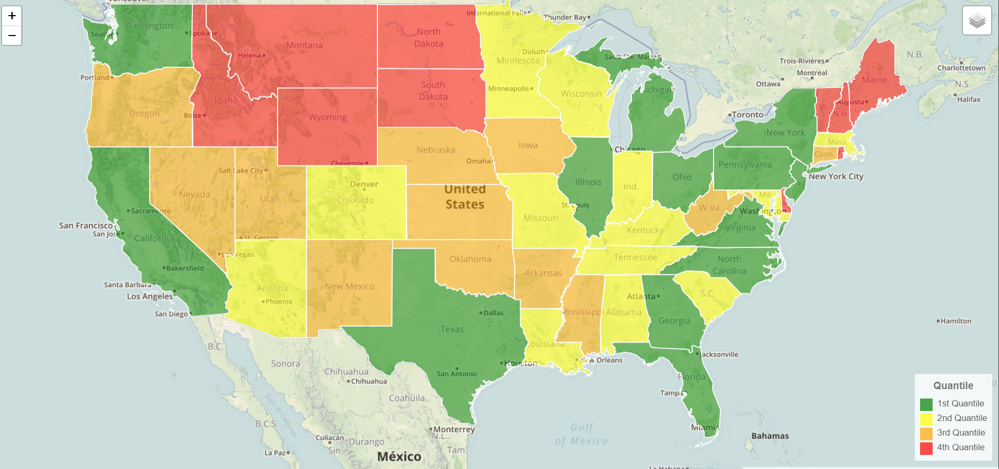

# Project2: State Population
Our task in this project was to demonstrate the population of each state in the USA across year 2013-2018 through data visualizations that could provide an interactive ways to users. 

Dataset:
DATA USA:https://datausa.io/api/data?drilldowns=State&measures=Population

Toolset:
Python & Flask, PostgresSQL, HTML, CSS, Bootstrap, Javascript, Leaflet.js, D3 for Map visualizations.
Credits:
Meagan Colley: Create Geomap of population quantle of each state for 2018, create highcharts for top 10 states in population 2014 vs 2018
Micheal Becker: DATA visualizations--HTML, CSS, Geomap
Xinliang Huang: Data Extraction from API, store data into PostgresSQL, create Flask to pull API, create bar chart of population average for each year, adding legends and layers into Geomap

Below is a flowchart for project 2: 

 Here is a Dataset preview in Postgres SQL: 

 Chart: 

Total Population:
 
Average Population:
 

 Dumbbell: 

 Geomap: 

